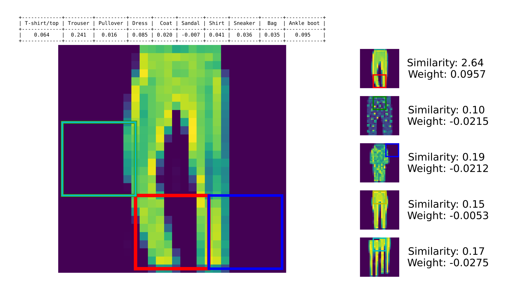
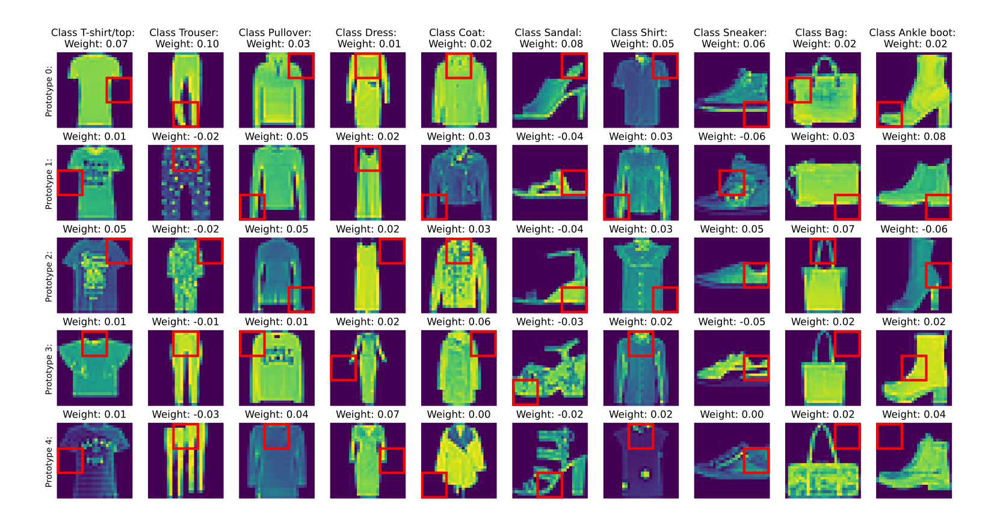
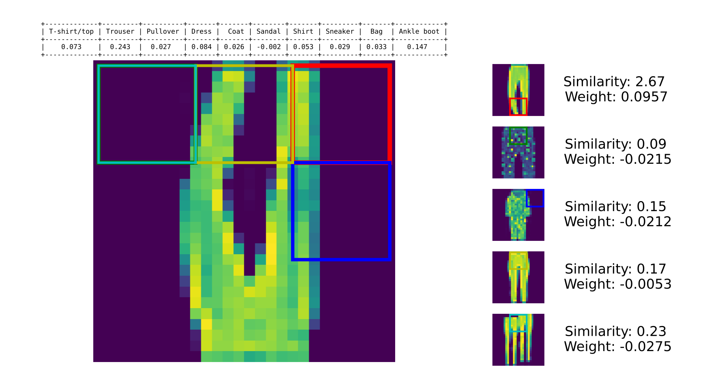

# Prototypical part network on fashion MNIST

## Introduction
Most deep learning models used for image classification are not inherently interpretable.
One idea to build a more interpretable image classifier is to have a neural network that
compares prototypical parts of images from the training data with a given sample to 
determine to what class it belongs [[2]](#2). This results in predictions as shown in fig. [1](#classify_trousers),
where the network outputs prototypes and associated similarity scores, hopefully making
it clearer how the network came to its classification of the image.
In this little side project, I am trying to implement such a Prototypical Part Network (ProtoPNet)
myself, taking pointers from other implementations (especially [[1]](#1) and [[2]](#2)).

<figure id="classify_trousers">
  
  <figcaption>
        Figure 1: Prediction of a ProtoPNet on a pair of trousers from FashionMNIST [[3]](#3). Note that the "red
            prototype" has a high similarity to the image, which is why the image is classified as coming form the
            "trousers" class. The other "trousers"-prototypes (which all have a negative weight) do not fit the
            image very well. Their rectangles are place at the points where the model deems that they fit best.
  </figcaption>
</figure>

## Usage
Simply download the repo, navigate to the repo-root and run 
```bash
    pip install -r ./requirements.txt
```
to install the required packages. 
After installation, you should be able to run the scripts `train_proto_pnet.py` and `train_conv_net.py`
located in the `interpretable_mnist` folder. To adjust hyperparameters (learning rate etc.),
you can use the `params.py` file in the same folder.
Note while you can technically run this on a CPU, this is probably not going to be very slow
and a pytorch-compatible GPU is recommended.

## (Way too short) explanation of ProtoPNets
Essentially, ProtoPNets start out as normal convolution neural network (ConvNet) on the input side,
but where a "normal" ConvNet would converge into fully-connected layers (i.e. after all the convolutions)
a ProtoPNet has some form of prototype layer and one final layer afterward that is akin to a fully-connected layer
(see [[2]](#2) for a pictorial overview). 

In the prototype layer (as implemented here), the distance of the latent representation of the image
towards the current prototypes of the model is calculated. That is, the model has a bunch of prototypes
(that are just vectors of length $d$) for every class, and the difference of each of these vectors
to each of the vectors in channel-direction of the latent image is taken. If the original input image has dimensions
channel ($K=1$ for grayscale) times height ($H$) times width ($W$), the latent image has the dimensions
latent channels ($k = d > K$) times latent height ($h < H$) times latent width ($w < W$). 
Since the size of the prototypes is chosen to be equal to the amount of channels in the latent image,
we get a $h \times w$ distance matrix $\overline{\rho}$ for every prototype the model has.

This matrix is converted into a prototype similarity $S$ using
$$S = \frac{\ln(\text{min}(\overline{\rho}) + 1)}{\ln(\text{min}(\overline{\rho}) + \epsilon)} - \frac{\ln(\text{mean}(\overline{\rho}) + 1)}{\ln(\text{mean}(\overline{\rho}) + \epsilon)}~,$$
where $\epsilon$ is a small number. This should correspond to the "focal similarity" as suggested in [[1]](#1).

For the implementation in this repository, the similarities to the prototypes of each class are then multiplied
with trainable weights and summed to arrive at an accumulated similarity for every class, which can be used
as a prediction for which class the image belongs to. This is slightly different from [[2]](#2), where this
output step is performed by a fully connected layer without bias between the final output and the similarities.
The difference is that, in [[2]](#2), the weighted sum over every prototype is used to arrive at the final output
value, while my implementation only uses the weighted sum over the prototypes of each individual class.
This way, the similarity of an image to prototypes of other classes does not factor into the overall 
similarity of an image to a class.

During training, the loss function for a ProtoPNet is slightly different from that of a traditional ConvNet,
and consists of the following terms (see [[2]](#2), [[1]](#1)):
- Cross-Entropy loss $L_e$ - The standard cross-entropy loss you would also use for training a traditional ConvNet
- Orthogonality loss $L_r$ - Difference between the prototypes as measured by cosine similarity
- Cluster loss $L_c$ - Minimum distance between prototypes of a class and samples of the **same** class
- Separation loss $L_s$ - Minimum distance between prototypes of a class and samples of the **other** classes

## Experiments
To test the model, I use the FashionMNIST [[3]](#3) dataset. It is neat that, after training, one can
visualize all the prototypes of the model to get an idea of what the model is looking for in the data
(see fig. [2](#model_prototype_overview)). When performing a prediction, the model also informs you of the
similarity of the prototypes to the image, and which area in the image is similar to the prototypes, as can be seen in
fig. [1](#classify_trousers). Note that fig. [2](#classify_trousers) shows all prototypes of the
class the image was predicted as, meaning prototypes of the class that do not really fit (i.e. they have a low similarity score) are also depicted.
<figure id="model_prototype_overview">
  
  <figcaption>
        Figure 2: Overview of all prototypes (in the red squares) of a trained ProtoPNet model and their weights. 
            The weights are chosen to sum to one, but can be negative, indicating that matching the prototype will reduce
            the samples probability to belong to a class. Note that there seem to be some rather unusual images in the trouser
            category, one with two trousers and one with a trouser and a pullover ([?](## "At this point, I am pretty sure
            that both ProtoPNets and ConvNets are better at classifying these images than I am")) to be precise, that
            actually reduce the probability of an image belonging to the "trouser" category.
  </figcaption>
</figure>

Let's take a closer look at how the model performs in [table 1](#tab_1), where I tested several
model configurations using different parts of the loss term in training. The different model 
configurations tested are:
- "baseline" - Leaving the `params.py`-file untouched
- "with batch norm" - Activating batch norm in the convolution part of the ProtoPNet
- "with transfer learning" - Train a traditional ConvNet first and use it as a starting point for the ProtoPNet
- "Manhattan distance" - Calculated the distance to the prototypes with Manhattan instead of Euclidean distance
- "unconstrained" - Remove constraint that prototypes for a certain class have to come from images of that class

|                        | $L_e$     | $ + L_r$   | $ + 0.8 L_c$ | $ - 0.08 L_s$ | 
|------------------------|-----------|------------|--------------|---------------|
| baseline               | 75.7/43.3 | 82.0/50.4  | 81.2/46.8    | 80.6/47.5     |
| with batch norm        | 67.2/33.5 | 82.4/50.0  | 77.8/43.7    | 81.4/37.9     |
| with transfer learning | 79.5/48.2 | 82.8/48.6  | 80.3/45.0    | 83.8/49.8     |
| Manhattan distance     | 80.8/43.4 | 80.7/48.2  | 79.4/45.3    | 80.4/49.2     |
| unconstrained          | 83.1/42.3 | 81.2/47.4  | 81.9/51.7    | 83.4/54.0     |
<p align="center" style="max-width: 500px">
<a id="tab_1">Table 1</a>: Accuracy [%] of different classification models during a single training run on the
test data and the vertically flipped test data, where in each column an additional loss term is
added during training. An explanation of the different model configurations in the different rows and columns is given
in the text.
</p>

To get the elephant out of the room first, while an accuracy of about 80% on the test data is of course way
better than random guessing (according to the GitHub page of [[3]](#3), the accuracy of humans with no
fashion expertise should be
around 83.5%), it is noticeably worse than that of other models, which easily achieve scores in the low-to mid
nineties (see the GitHub page of [[3]](#3)). Even running the rather simple ConvNet that comes in this
repository (and, in contrast to the ProtoPNet, took only a few hours to get working) gives me a result of
90.9% with batch norm and 89.2% without it. 
While the performance on the vertically flipped test data dropped to 26.9% and 29.7% with and without batch norm, 
respectively, this does not really make up for the big performance drop on the actual test data. Also, if
performance on these out-of-distribution samples were important, one could just add the vertical flip as a
data augmentation during training and probably achieve the same accuracy as on the normal test set.

Beyond this, we can see in [table 1](#tab_1) that, surprisingly, the loss terms beyond the cross-entropy loss
do not really seem to matter all that much here. Though it is unclear whether the differences between
the different model configurations are just noise (since each entry in [table 1](#tab_1) constitutes
only a single simulation), the orthogonality loss seems to be somewhat useful. As it also seems to
increase the diversity of prototypes chosen by the model, I would say it is worth keeping it in here, 
whereas the other two losses do not seem to do much in my ProtoPNet implementation.

Another interesting point that can be gleaned from [table 1](#tab_1) is that, in this case, using a pretrained ConvNet 
as a starting point for the ProtoPNet does not seem to lead to a noticeable improvement in prediction accuracy.
This is rather surprising, as both [[2]](#2) and [[1]](#1) utilize pretrained networks as the basis for their
prototypical network. This ineffectiveness is probably unique to this specific setting though,
as the training data that the pretrained network sees is the same as what the ProtoPNet gets and the dataset is small
enough that running a few more epochs is not constraining. 


## Should you use a ProtoPNet instead of a ConvNet for your project?
This is of course a question that will depend heavily on your specific requirements and I cannot answer for you.
However, I can give my thoughts on the Pros and Cons of ProtoPNets. Bear in mind though that these are **solely**
based on my limited experience with my implementation on FashionMNIST here.
Pros: 
 - Provide a certain degree of interpretability to your predictions ...
 - Comparable accuracy as non-interpretable counterparts according to [[2]](#2) and [[1]](#1) ...
 - Might be more robust to deviations of novel data from the training data.
Cons:
 - ... though prototype similarity as perceived by the model can be confusing (see fig. [3](#classify_inverted_trousers)
 - ... which might be difficult to replicate (I could not do so here, might be an error on my part though).
 - Not "off-the-shelf" models, require more work to set up than analogous non-interpretable model


<figure id="classify_inverted_trousers">
  
  <figcaption>
        Figure 3: Prediction of a ProtoPNet on a pair of trousers from FashionMNIST [[3]](#3), where the image has
            been inverted vertically. Interestingly, though the "red prototype" does have a very high similarity,
            its localization does not seem quite right. Note that the model was not trained with this sort of data
            augmentation, i.e. this is an out-of-distribution image for the model.
  </figcaption>
</figure>


## A note on locality in ProtoPNets
As pointed out in [[4]](#4), the prototypes of most ProtoPNets, such as [[2]](#2) and [[1]](#1), do not necessarily
localize to parts of a training image, but are influenced by the training image as a whole. 
From what I understand, this is caused by the receptive field of the "convolutional part" of
the ProtoPNet covering, in the worst case, the entire training image. 
I think this can be avoided by carefully selecting the settings of the convolutional layers,
essentially avoiding overlap between the kernels, which I tried to do here.
So the areas that mark the prototypes in the training images **should** actually correspond exactly to what
the model uses (though fig. [3](#classify_inverted_trousers) really does look like there still is a localization
problem, so I might be mistaken :-) ).


## References
<a id="1">[1]</a>
D. Rymarczyk et al., "Interpretable Image Classification with Differentiable Prototypes Assignment"
in book: Computer Vision – ECCV 2022 (pp.351-368), 2022, [URL](https://www.researchgate.net/publication/364650700_Interpretable_Image_Classification_with_Differentiable_Prototypes_Assignment),
DOI: 10.1007/978-3-031-19775-8_21

<a id="2">[2]</a>
C. Chen et al., "This Looks Like That: Deep Learning for Interpretable Image Recognition"
Advances in Neural Information Processing Systems 32 (NeurIPS 2019), 2019, [URL](https://arxiv.org/abs/1806.10574),
DOI: 10.48550/arXiv.1806.10574

<a id="3">[3]</a>
H. Xiao et al., “Fashion-MNIST: a Novel Image Dataset for Benchmarking Machine Learning Algorithms.”
arXiv, 2017, [URL](http://arxiv.org/abs/1708.07747), [GitHub](https://github.com/zalandoresearch/fashion-mnist)

<a id="4">[4]</a>
Z. Carmichael et al., “Pixel-Grounded Prototypical Part Networks”
arXiv, 2023, [URL](http://arxiv.org/abs/2309.14531)
